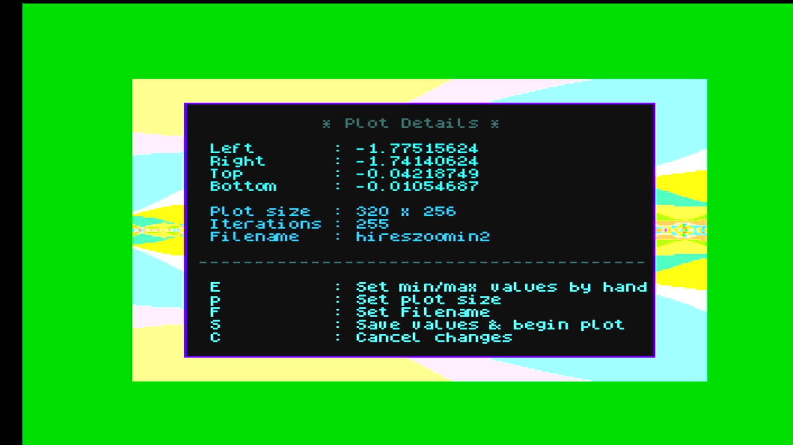

mention Nextbuild somewhere then do the nxtel stuff....

# Next Fractal Explorer

### What is Next Fractal Explorer?

A Mandelbrot Plotter for the ZX Spectrum Next.

The original Spectrum from the 1980s with its 32x24, 8 colour resolution wasn't really up to the job...

But the Next, with 256 colours, higher resolutions and a faster CPU is more than capable!

NFE is open source software, and licensed under the GPLV3.

### What can NFE do?

It allows users to explore the Mandlebrot set on a ZX Spectrum Next. It can zoom in, and in, to reveal more detail and complexity, and make some very pretty pictures while it's about it.

NFE works in both 256x192 and 320x256 screen modes, has a color cycling mode, and comes with a program for Linux/Mac/Windows that allows you to generate colour palettes for NFE from images on your computer.

### What's the point?

Fractals, on a Spectrum! No more needs to be said.

### Installation

Copy the NFE directory to your NEXT SD Card.

### Running

Using the browser, navigate to the NFE directory and select NFE.bas or Enter NextBasic, or the command line, and cd to the NFE directory. Then enter load "nfe.bas" and press enter.

#### Main screen 

When NFE has loaded, it will display the default plot and a menu.

#### Menu 

The menu options are described below.

##### Load Plot
This option loads a previously generated plot, using the  Next browser to select the required plot.

When Enter is pressed, the plot will be loaded.

Hint - the menu can be [hidden](#show/hide-menu) so that all of the plot can be seen, e.g.

##### Load Palette
This option loads a palette, changing the colours used to display the plot.

The Next browser is used to select a palette

and then the palette is applied.

The Mo256 palette ...

The Misty256 palette ...

NFE comes with a program that allows users to create their own palletes. See [Creating Palettes](#Creating-Palettes) below.

##### Zoom Mode

Zoom mode is the way in which new plots can be created. It allows users to select a portion of the currently loaded plot, and have a plot made of the selected area. In other words, it zooms in...

When zoom mode is activated for the very first time, a help window automaticallu appears. This window can be dismissed and also shown again at any time in zoom mode by pressing 'H'.

With the help window dismissed the current plot and the selection crosshairs are shown.

Sometimes the crosshairs can be difficult to see against the background of the plot. If so, pressing the space bar will cause the crosshairs to change to a random color. This can be repeated until the crosshairs can be easily seen.

The size of the cross hair can be changed from the maximum as seen in the image below to the minimum shown in the image below that.

The crosshairs can be moved to an area of interest.

Then, to plot this area zoom mode has to exited. This can be be done by pressing the 'z' key. A new window will appear so that the details of the new plot can be set and confirmed.

Note : the coordinates of the plot (Left, Right,Top, Bottom) can be edited, but it most cases there is no need to do this, as they are automatically set according to the  position and size of the crosshairs. As explained in the zoom mode help window, the coordinates should only be edited if entering some coordinates obtained from another Mandlebrot Plotting tool. 

Pressing P toggles the plot size between the two available values 256x192 and 320x200. The larger size obviously has more detail but takes a correspondingly longer time to plot.

When F is pressed the filename that the plot will be saved under can be entered. Note, there is no need to include the ".mnd" extension, as this is added automatically when the plot is saved.

If C is pressed and the changes are cancelled, zoom mode will be abandoned and NFE will return to main menu.d

When the relevant details have been entered e.g. 

pressing the S key will save the entered values, clear the scree and begin the plot of the zoomed in area..

Note that plotting can take some time, especially when zooming in closer and closer to detailed areas. Even with the Next running at top speed, plots such these can take two or three hours to complete. 

The Final Result ... When the plot is finished it is automatically saved (using the specified name) into the Plots directory, and can be loaded from there at any time.

If desired, the zoomed plot can be further zoomed into.

The confirmation screen for this.

The finished plot.

Again?

Yet another confirmation screen...

... and the result.

##### Migraine Mode

Migraine Mode causes the colours in the currently loaded plot to rapidly cycle in a psychodelic fashion.

On entering Migraine Mode an information panel appears. 

This message can be permanently dismissed if desired.

##### Show/Hide Menu

As previously mentioned, this option can be used to temporarily dismiss the menu, so that the currently loaded plot can be seen and appreciated in its entirity.

##### About

This option displays information about NFE. It can be dismissed by pressing the A key.

##### Quit

No explanation needed...

#### Creating Palettes

Next Fractal Explores comes with a program for PCs that allows you to generate palettes by extracting colours from images (jpegs, pngs etc) on your PC or Laptop. This program, pcd.py, works on both Windows 10 and Linux. It is untested on Windows 11 and MacOs, but may well work on both of these platforms too.

 ##### pcd.py Installation Instructions 
1. pcd.py uses the Python programming language, so this must be installed. Windows users will probably need to go to the Microsoft Store and search for and install the latest version of Python3. Linux users will most likely find that their distrubution has installed Python by default...
2. Install [pipx](https://github.com/pypa/pipx "pipx home") a tool for installing python applications. Instructions can be found [here](https://github.com/pypa/pipx?tab=readme-ov-file#install-pipx "pipx install") for Linux, Windows, and MacOs.
3. Use pipx to install a python application, [Pylette](https://github.com/qTipTip/Pylette "pylette home page"), that extracts colours from images
4. On your PC, create a directory somewhere in your home directory e.g. "NFEPal" and copy the pcd.py file to it. 

##### How to create a pallette

1. Find an image with some appealing colours. The picture below (Daisy's and Edwina's) will be used as an example.
 

1. Windows users, open Command Prompt or Powershell, Linux users, open your preferred terminal app. cd to the "NFEPal" (or whatever it was named) directory.
2. pcd.py can be run from the terminal/Command Prompt. It takes two arguments, the full path to the image, and the filename name that the generated palette will be saved to. In this example the palette will be called "funkyflorists". Therefore, on Linux the command would be `./pcd.py DaisysandEdwnas.JPG funkyflorists`. On Windows it would be `python3` (or maybe `python` or `py`) `pcd.py "DaisysandEdwinas" "funkyflorists"`
3. The terminal will report when the palette has been generated, and will display the palette filename.

Some things to note

* the .pal extension is added automatically to the palette filename, and the 256 following "funkyflorists" is added to indicate the number of colours in the palette. 
 
* pcd.py works by running pylette to extract colours from the image, then it converts the rgb colours that pylette extracts from the image into the rgb3 format that the Next uses. Finally, it writes the converted values into a file format that can be read on the Next.
 
* The conversion to rgb3 will inevitably mean that colours in the generated palette may not be an exact match to the colours extracted by pylette. Also, very similar colours in the source image will end up being assigned the same rgb3 values, leading to blocks of duplicate colours in the palette.

##### Copying generated palettes to the NEXT

Simply copy the generated palette to the 'palettes' directory of NFE on whichever SD card or storage medium it has been installed to. Once that has been been done it can be applied to the current plot by simply selecting from the 'Load Palette' option of the NFE main menu.

This is what the funkyflorists palette looks like when applied to a plot.

##### Viewing palettes on the NEXT

When NFE is running, palettes can be applied to the current plot by simply selecting them from the 'Load Palette' option of the NFE main menu, as previously explained. 

However, NFE also comes with a BASIC program - Palette-Viewer.bas - which displays the colours in a pallete.

When Palette-Viewer is loaded, the NEXT browser is shown so that a palette can be selected.

It will then be displayed.

For comparison, the original image and the generated palette side by side.

Some more examples...

Yes, cats are cool!
### Under The Hood

Next Fractal Explorer is mostly written in NextBASIC, and makes extensive use of banked code. 

[Nextbuild](https://github.com/em00k/NextBuild "Nextbuild homepage") is used for the Mandelbrot plotting routine, giving a massive speed increase compared to NextBasic.

The palette rotating code used in Migraine mode is written in Z80 assembly language, and can be assembled with
[sjasmplus](https://github.com/z00m128/sjasmplus "sjasmplus homepage").

